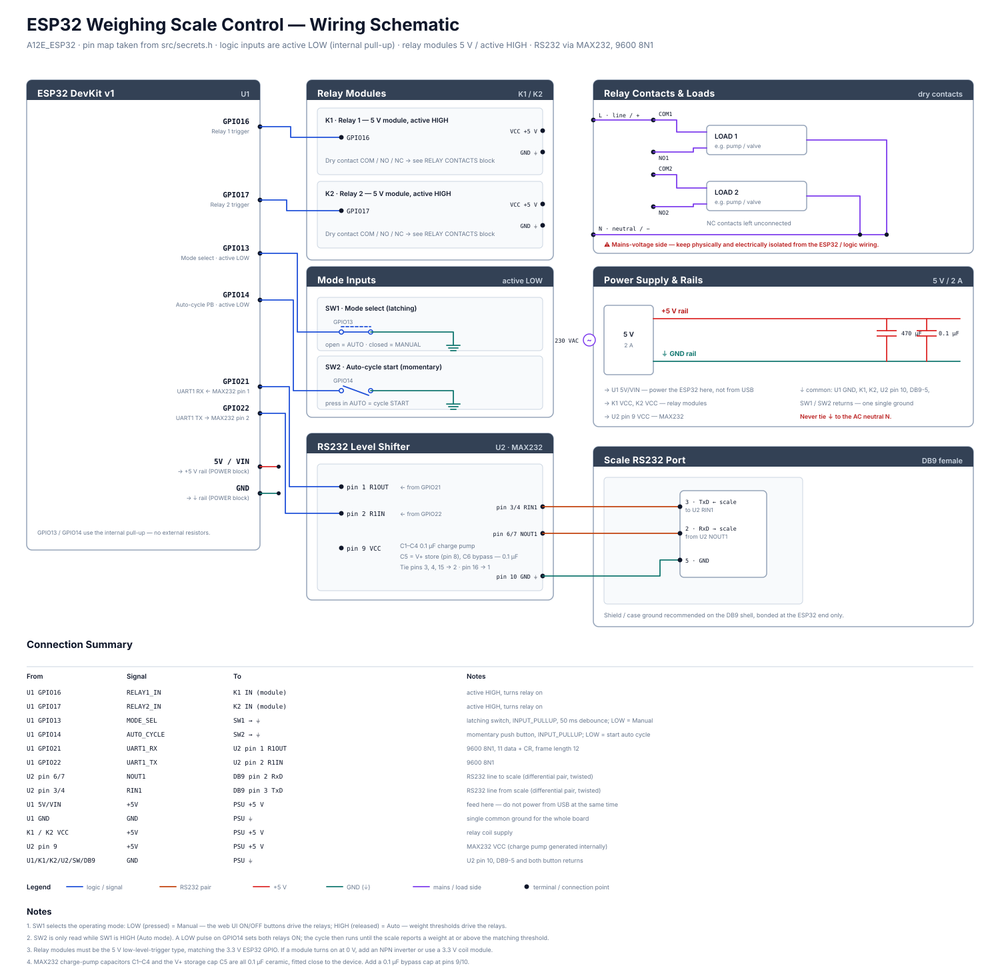

# ESP32 Scale Control System

Complete IoT weighing system with web-based control interface for ESP32.

## Project Structure

```
A12E_ESP32/
├── include/
│   └── secrets.h           # Configuration (WiFi, pins, thresholds)
├── src/
│   └── main.cpp            # Main firmware
├── data/
│   └── index.html          # Web UI (served from LittleFS)
├── docs/
│   └── schematic.svg       # Full wiring schematic (open in any browser)
├── platformio.ini          # PlatformIO configuration
├── .gitignore              # Git ignore file
└── README.md              # This file
```

## Hardware Schematic



Full wiring diagram: [`docs/schematic.svg`](docs/schematic.svg) — open it in any
browser, or drop it straight into an Inkscape / Illustrator / KiCad canvas.
It covers the ESP32 pin map, relay modules, mode push buttons, the MAX232
RS232 level shifter, the DB9 scale port and the 5 V power rails.

## Features

✅ **WiFi Access Point (AP)** - No router needed  
✅ **Async Web Server** - Responsive, non-blocking  
✅ **LittleFS Storage** - Store web UI on ESP32  
✅ **Real-time Updates** - 1-second refresh rate  
✅ **Auto Relay Control** - Automatic activation based on weight  
✅ **Manual Relay Control** - Override via web interface  
✅ **Physical Mode Switch** - Manual / Auto selector and cycle-start button  
✅ **Config Persistence** - Thresholds and mode saved to LittleFS  
✅ **RS232 Serial Communication** - Weight reading from scale  
✅ **Responsive UI** - Works on mobile and desktop  
✅ **Error Handling** - Connection monitoring  
✅ **Debug Logging** - Detailed serial output  

## Operating Modes

The mode is set by **SW1 (GPIO13)**, not by the web UI. On boot the physical
switch position wins over the value saved in `config.json`.

| SW1 (GPIO13) | Mode | Relay control |
|--------------|------|---------------|
| LOW (pressed) | **Manual** | Web UI ON/OFF buttons (`/api/relay`) |
| HIGH (released) | **Auto** | Weight thresholds from the scale |

In **Auto** mode, pressing **SW2 (GPIO14)** starts a cycle: both relays turn ON
and stay ON until the scale reports a weight at or above the matching
threshold, which switches that relay off again. Switching modes always forces
both relays OFF.

## Hardware Requirements

- **ESP32 DevKit v1** (or similar)
- **2x 5 V low-level-trigger relay module** (IN: GPIO16, GPIO17)
  - Must be the *low-level trigger* type so a 3.3 V HIGH energises it
  - Contacts are dry (COM / NO / NC) and switch the load side, not the logic
- **2x push button** — both to GND, active LOW, using the ESP32 internal pull-up
  - SW1 — latching / toggle: mode select (GPIO13)
  - SW2 — momentary: start auto cycle (GPIO14)
- **MAX232** RS232 transceiver, DIP-16, + 6x 0.1 µF ceramic capacitors
  - ESP32 RX (GPIO21) ← pin 1 (R1OUT)
  - ESP32 TX (GPIO22) → pin 2 (R1IN)
  - pins 6/7 (NOUT1) → DB9 pin 2 (scale RxD)
  - pins 3/4 (RIN1) → DB9 pin 3 (scale TxD)
  - pin 10 → GND
- **RS232 serial scale** with a DB9 female port
- **DB9 female connector** + shielded twisted-pair cable
- **5 V / 2 A DC supply** — feed the ESP32 `5V/VIN` pin from this, not from USB
  - Powers the ESP32, both relay modules and the MAX232
  - All grounds common; never tie GND to AC neutral
- **USB cable** — flashing and serial monitor only (do not power simultaneously)

See [`docs/schematic.svg`](docs/schematic.svg) for the full wiring diagram.

## Setup Instructions

### 1. Install Dependencies

**VSCode + PlatformIO Extension:**
```bash
# Extensions required:
- PlatformIO IDE
```

### 2. Configure Hardware (Edit `src/secrets.h`)

`src/secrets.h` is the file the firmware actually reads — `main.cpp` includes
`"secrets.h"` and the compiler resolves it from `src/` first. The copy in
`include/` is unused.

```cpp
// WiFi AP Settings
#define WIFI_SSID "ESP32_Scale"
#define WIFI_PASSWORD "12345678"

// Pin Configuration
#define RELAY_PIN_1 16          // GPIO16 -> Relay 1 IN
#define RELAY_PIN_2 17          // GPIO17 -> Relay 2 IN
#define MANUAL_MODE_PIN 13      // GPIO13 -> SW1, active LOW (HIGH = Auto)
#define AUTO_MODE_PIN 14        // GPIO14 -> SW2, active LOW, momentary
#define RS232_RX_PIN 21         // GPIO21 -> MAX232 pin 1 (R1OUT)
#define RS232_TX_PIN 22         // GPIO22 -> MAX232 pin 2 (R1IN)

// Weight Thresholds (kg)
#define WEIGHT_THRESHOLD_RELAY1 100.0
#define WEIGHT_THRESHOLD_RELAY2 200.0
```

Thresholds and mode are persisted to `/config.json` in LittleFS at runtime and
can be changed from the web UI, so editing these values only sets the
power-on defaults for a freshly erased filesystem.

### 3. Build and Upload

**Terminal in VSCode:**

```bash
# Upload filesystem (HTML to LittleFS)
pio run --target uploadfs

# Upload firmware
pio run --target upload

# Monitor serial output
pio device monitor
```

### 4. Connect from Phone

1. **WiFi Connection:**
   - Search for: `ESP32_Scale`
   - Password: `12345678`

2. **Open Browser:**
   - Navigate to: `http://192.168.4.1`
   - You should see the Scale Control UI

## API Endpoints

### GET `/api/status`
Returns current system state:
```json
{
  "weight": 75.3,
  "relay1": false,
  "relay2": false,
  "relay1_threshold": 100.0,
  "relay2_threshold": 200.0
}
```

### GET `/api/relay?relay=1&state=1`
Control relay:
- `relay`: 1 or 2
- `state`: 0 (OFF) or 1 (ON)

Returns same as `/api/status`

## Serial Output Example

```
========================================
    ESP32 SCALE CONTROL SYSTEM v1.0
========================================
Chip Model: ESP32
Chip Revision: 3
Flash Size: 4 MB
Free Heap: 180 KB
========================================

[RELAYS] Initializing relay pins...
[RELAYS] Relay 1 (GPIO16) - OFF
[RELAYS] Relay 2 (GPIO17) - OFF
[RS232] Initializing RS232 communication...
[RS232] Baud Rate: 9600
[RS232] RX Pin: GPIO21
[RS232] TX Pin: GPIO22
[FS] Mounting LittleFS...
[FS] LittleFS mounted successfully
[FS] Files in LittleFS:
     - index.html (8945 bytes)
[WiFi] Setting up Access Point...
[WiFi] Access Point started successfully!
[WiFi] SSID: ESP32_Scale
[WiFi] Password: 12345678
[WiFi] IP Address: 192.168.4.1
[WiFi] Connect your phone to WiFi and open http://192.168.4.1
[WEB] Initializing web server...
[WEB] Web server started on port 80
[SYSTEM] Setup complete - System ready!

[SCALE] Weight: 75.3 kg
[RELAYS] Relay 1 auto-activated: OFF
[RELAYS] Relay 2 auto-activated: OFF

[WEB] Relay control request - Relay: 1, State: 1
[RELAYS] Relay 1 turned ON
```

## RS232 Frame Format

Expected format from scale:
```
W n 0 0 0 0 0 4 . 3 k g
0 1 2 3 4 5 6 7 8 9 10 11
```

- Position 0: 'W' or 'w' (frame identifier)
- Positions 2-7: Weight digits (spaces skipped)
- Position 9: Decimal digit
- Ends with: `\r\n`

## Troubleshooting

### Can't find ESP32 serial port
```bash
pio device list
```

### LittleFS not uploading
```bash
# Clean and rebuild
pio run --target cleanall
pio run --target uploadfs
pio run --target upload
```

### WiFi not starting
- Check that AP credentials are set in `secrets.h`
- Ensure WiFi module is properly connected

### Web UI not loading
- Verify `index.html` is in `data/` folder
- Run `pio run --target uploadfs` again
- Check serial output for LittleFS mounting errors

### Relays not activating
- Check GPIO pins (16, 17) are correctly wired
- Verify relay module voltage requirements (typically 5V)
- Check weight thresholds in `secrets.h`

## Web UI Features

- **Real-time Weight Display** - Updates every second
- **Relay Status Indicators** - Visual feedback (green=ON, red=OFF)
- **Manual Control Buttons** - Override auto-mode
- **Threshold Display** - Shows current activation thresholds
- **Connection Status** - Shows connection state
- **Responsive Design** - Optimized for mobile and desktop
- **Error Handling** - Displays connection errors

## Libraries Used

| Library | Version | Purpose |
|---------|---------|----------|
| ESPAsyncWebServer | 1.2.3 | Non-blocking web server |
| AsyncTCP | 1.1.1 | TCP support for async server |
| ArduinoJson | 6.21.2 | JSON serialization |
| LittleFS_MBED | Latest | Flash filesystem |

## Power Consumption

- Idle: ~50-100 mA
- Active (WiFi + Server): ~150-200 mA
- With relays activated: ~200-300 mA

## Performance

- **Response Time:** <100ms
- **Update Frequency:** 1Hz (1 second)
- **Concurrent Connections:** Up to 10
- **Memory Usage:** ~60KB Flash (firmware) + 8KB (web UI)

## Security Notes

⚠️ **Important:**
- `secrets.h` contains WiFi credentials
- Add to `.gitignore` before pushing to GitHub
- Change default WiFi password in production
- No authentication on web API (local network only)

## Future Enhancements

- [ ] SPIFFS support
- [ ] OTA (Over-The-Air) updates
- [ ] Data logging to SD card
- [ ] MQTT integration
- [ ] Advanced analytics
- [ ] Email notifications
- [ ] Mobile app

## Author

ESP32 Scale Control System v1.0

## License

MIT License - Feel free to use and modify

---

**Questions or Issues?** Check the troubleshooting section or open an issue on GitHub.
